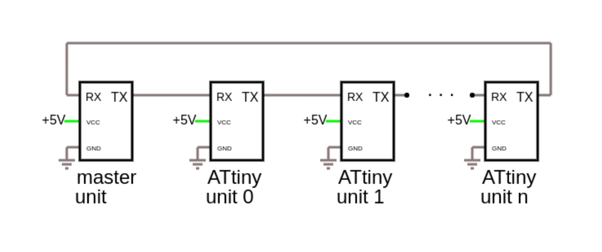
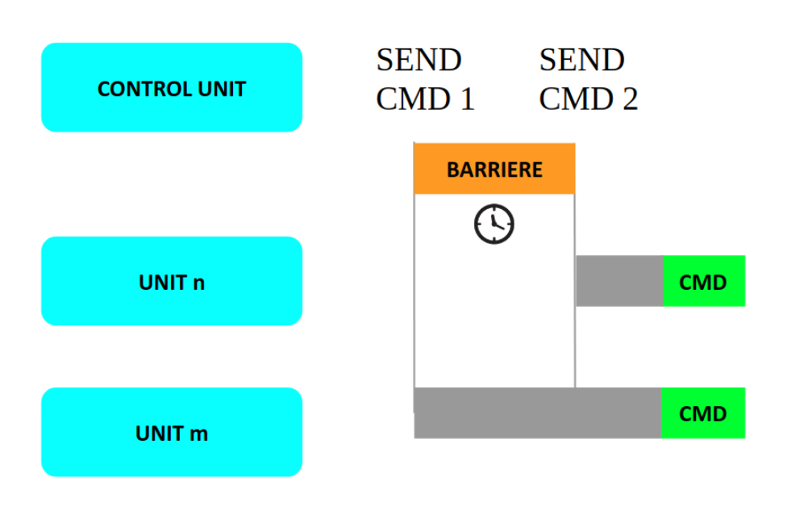
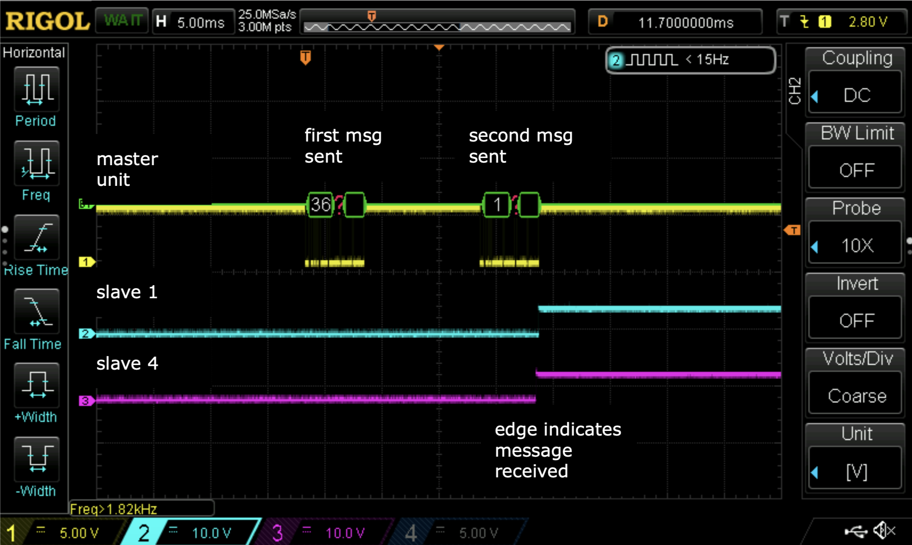
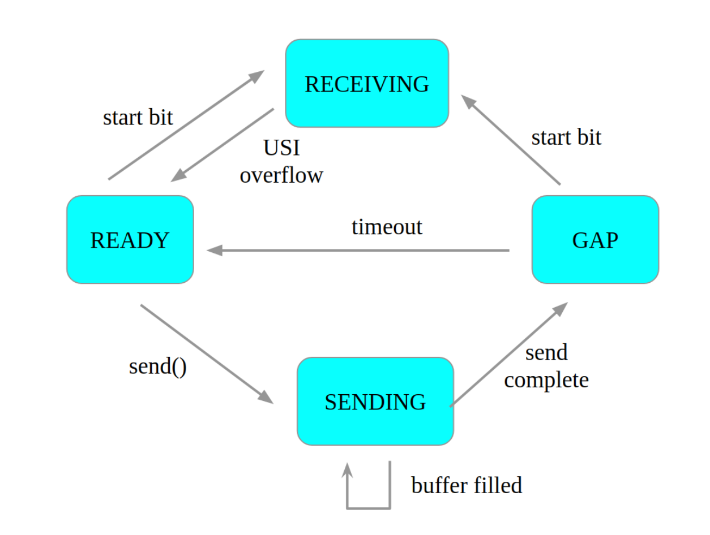

# AttinyUSI

Repository for a proof-of-concept reliable, daisy-chained attiny USI communication with timed packages.

Connecting the ATtinys like so allows for us to send timed packages to ensure that two messages reach different units in the daisy-chain at the same time

To make sure that differently tuned oscillators do not affect the timing of the messages, each units receive&send times are measured and used to calculate the ideal timing of the messages by the master-unit during initialization.

This screenshot shows the timing in action. Two messages are sent from the master unit to two different units at different points in the chain and both units reveice the messages very close to one another.

The slave-units themselves have the following states and transitions:

For more information read the [report](https://github.com/boeckhoff/AttinyUSI/blob/master/USISerialReport.pdf)(german only)

References/Sources:

ATtiny Datasheet http://ww1.microchip.com/downloads/en/DeviceDoc/Atmel-2586-AVR-8-bit-Microcontroller-ATtiny25-ATtiny45-ATtiny85_Datasheet.pdf

AVR instruction Set Manual http://ww1.microchip.com/downloads/en/devicedoc/atmel-0856-avr-instruction-set-manual.pdf

Introduction to pin change interrupts and timers https://embeddedthoughts.com/2016/06/06/attiny85-introduction-to-pin-change-and-timer-interrupts/

Blog Post on USI http://becomingmaker.com/usi-serial-uart-attiny85/

USI receive reference implementation https://github.com/MarkOsborne/becomingmaker/tree/master/USISerial

USI send reference implementation https://github.com/MarkOsborne/becomingmaker/tree/master/USISerialSend

Atmel app note AVR307 https://www.microchip.com/wwwAppNotes/AppNotes.aspx?appnote=en591877
